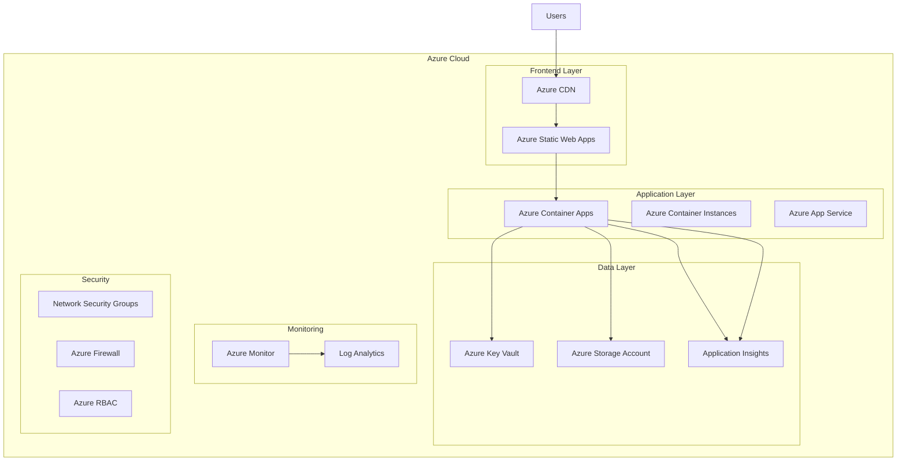

# Azure Production Deployment Guide

This comprehensive guide covers deploying Azure Image Studio to Azure production environments with enterprise-grade security, scalability, and monitoring.

> ⚠️ **Important**: This is a **community project** and is not affiliated with or endorsed by Microsoft or Azure. It's an independent project that uses Azure AI services.

**Last Updated**: January 2025  
**Version**: 1.0.2

## 🎯 Overview

This guide provides step-by-step instructions for deploying Azure Image Studio to Azure production environments using various Azure services:

- **Azure App Service** - For containerized applications
- **Azure Container Apps** - For microservices architecture
- **Azure Static Web Apps** - For static frontend deployment
- **Azure Container Instances** - For simple container deployments

## 🏗️ Architecture Overview

### Production Architecture



## 🚀 Deployment Options

### Option 1: Azure App Service (Recommended)

Best for: Full-stack applications with custom domains and SSL

#### Prerequisites

- Azure subscription
- Azure CLI installed
- Docker installed (for containerized deployment)
- GitHub repository

#### 1. Create Resource Group

```bash
# Login to Azure
az login

# Create resource group
az group create \
  --name rg-azure-image-studio-prod \
  --location "East US"
```

#### 2. Create App Service Plan

```bash
# Create App Service Plan
az appservice plan create \
  --name asp-azure-image-studio-prod \
  --resource-group rg-azure-image-studio-prod \
  --sku P1V2 \
  --is-linux
```

#### 3. Create Web App

```bash
# Create Web App
az webapp create \
  --name azure-image-studio-prod \
  --resource-group rg-azure-image-studio-prod \
  --plan asp-azure-image-studio-prod \
  --runtime "NODE|20-lts"
```

#### 4. Configure Application Settings

```bash
# Set environment variables
az webapp config appsettings set \
  --name azure-image-studio-prod \
  --resource-group rg-azure-image-studio-prod \
  --settings \
    NODE_ENV=production \
    AZURE_API_KEY=your_production_api_key \
    NEXT_PUBLIC_APP_URL=https://azure-image-studio-prod.azurewebsites.net \
    PORT=8080
```

#### 5. Deploy from GitHub

```bash
# Configure deployment source
az webapp deployment source config \
  --name azure-image-studio-prod \
  --resource-group rg-azure-image-studio-prod \
  --repo-url https://github.com/yourusername/azure-image-studio \
  --branch main \
  --manual-integration
```

#### 6. Configure Custom Domain and SSL

```bash
# Add custom domain
az webapp config hostname add \
  --webapp-name azure-image-studio-prod \
  --resource-group rg-azure-image-studio-prod \
  --hostname yourdomain.com

# Configure SSL
az webapp config ssl bind \
  --name azure-image-studio-prod \
  --resource-group rg-azure-image-studio-prod \
  --certificate-thumbprint your_cert_thumbprint
```

### Option 2: Azure Container Apps

Best for: Microservices and containerized applications

#### 1. Create Container Apps Environment

```bash
# Create Container Apps environment
az containerapp env create \
  --name cae-azure-image-studio-prod \
  --resource-group rg-azure-image-studio-prod \
  --location "East US"
```

#### 2. Create Container App

```bash
# Create Container App
az containerapp create \
  --name ca-azure-image-studio-prod \
  --resource-group rg-azure-image-studio-prod \
  --environment cae-azure-image-studio-prod \
  --image your-registry.azurecr.io/azure-image-studio:latest \
  --target-port 3000 \
  --ingress external \
  --min-replicas 1 \
  --max-replicas 10 \
  --cpu 1.0 \
  --memory 2.0Gi \
  --env-vars \
    NODE_ENV=production \
    AZURE_API_KEY=your_production_api_key \
    NEXT_PUBLIC_APP_URL=https://ca-azure-image-studio-prod.azurecontainerapps.io
```

#### 3. Configure Auto-scaling

```bash
# Configure auto-scaling
az containerapp update \
  --name ca-azure-image-studio-prod \
  --resource-group rg-azure-image-studio-prod \
  --min-replicas 2 \
  --max-replicas 20 \
  --scale-rule-name "http-scaling" \
  --scale-rule-type "http" \
  --scale-rule-metadata "concurrentRequests=100"
```

### Option 3: Azure Static Web Apps

Best for: Static frontend with API integration

#### 1. Create Static Web App

```bash
# Create Static Web App
az staticwebapp create \
  --name swa-azure-image-studio-prod \
  --resource-group rg-azure-image-studio-prod \
  --source https://github.com/yourusername/azure-image-studio \
  --location "East US 2" \
  --branch main \
  --app-location "/" \
  --output-location "out" \
  --login-with-github
```

#### 2. Configure API Integration

```bash
# Configure API settings
az staticwebapp appsettings set \
  --name swa-azure-image-studio-prod \
  --setting-names \
    AZURE_API_KEY=your_production_api_key \
    NEXT_PUBLIC_APP_URL=https://swa-azure-image-studio-prod.azurestaticapps.net
```

## 🔐 Security Configuration

### 1. Azure Key Vault Integration

#### Create Key Vault

```bash
# Create Key Vault
az keyvault create \
  --name kv-azure-image-studio-prod \
  --resource-group rg-azure-image-studio-prod \
  --location "East US" \
  --sku standard
```

#### Store Secrets

```bash
# Store API key
az keyvault secret set \
  --vault-name kv-azure-image-studio-prod \
  --name "azure-api-key" \
  --value "your_production_api_key"

# Store database connection string
az keyvault secret set \
  --vault-name kv-azure-image-studio-prod \
  --name "database-connection" \
  --value "your_database_connection_string"
```

#### Configure Managed Identity

```bash
# Enable system-assigned managed identity
az webapp identity assign \
  --name azure-image-studio-prod \
  --resource-group rg-azure-image-studio-prod

# Grant access to Key Vault
az keyvault set-policy \
  --name kv-azure-image-studio-prod \
  --object-id $(az webapp identity show --name azure-image-studio-prod --resource-group rg-azure-image-studio-prod --query principalId -o tsv) \
  --secret-permissions get list
```

### 2. Network Security

#### Create Virtual Network

```bash
# Create virtual network
az network vnet create \
  --name vnet-azure-image-studio-prod \
  --resource-group rg-azure-image-studio-prod \
  --location "East US" \
  --address-prefix 10.0.0.0/16

# Create subnet
az network vnet subnet create \
  --name snet-azure-image-studio-prod \
  --resource-group rg-azure-image-studio-prod \
  --vnet-name vnet-azure-image-studio-prod \
  --address-prefix 10.0.1.0/24
```

#### Configure Network Security Groups

```bash
# Create NSG
az network nsg create \
  --name nsg-azure-image-studio-prod \
  --resource-group rg-azure-image-studio-prod \
  --location "East US"

# Allow HTTPS traffic
az network nsg rule create \
  --name "AllowHTTPS" \
  --resource-group rg-azure-image-studio-prod \
  --nsg-name nsg-azure-image-studio-prod \
  --priority 100 \
  --source-address-prefixes "*" \
  --source-port-ranges "*" \
  --destination-address-prefixes "*" \
  --destination-port-ranges 443 \
  --access Allow \
  --protocol Tcp
```

### 3. Application Security

#### Configure CORS

```typescript
// next.config.ts
const nextConfig: NextConfig = {
  async headers() {
    return [
      {
        source: '/api/:path*',
        headers: [
          {
            key: 'Access-Control-Allow-Origin',
            value: process.env.NODE_ENV === 'production' 
              ? 'https://yourdomain.com' 
              : '*'
          },
          {
            key: 'Access-Control-Allow-Methods',
            value: 'GET, POST, PUT, DELETE, OPTIONS'
          },
          {
            key: 'Access-Control-Allow-Headers',
            value: 'Content-Type, Authorization'
          }
        ]
      }
    ]
  }
}
```

#### Rate Limiting

```typescript
// middleware.ts
import { NextResponse } from 'next/server'
import type { NextRequest } from 'next/server'

const rateLimit = new Map()

export function middleware(request: NextRequest) {
  const ip = request.ip ?? '127.0.0.1'
  const limit = 100
  const windowMs = 15 * 60 * 1000 // 15 minutes
  
  if (!rateLimit.has(ip)) {
    rateLimit.set(ip, { count: 0, resetTime: Date.now() + windowMs })
  }
  
  const ipData = rateLimit.get(ip)
  
  if (Date.now() > ipData.resetTime) {
    ipData.count = 0
    ipData.resetTime = Date.now() + windowMs
  }
  
  if (ipData.count >= limit) {
    return new NextResponse('Too Many Requests', { status: 429 })
  }
  
  ipData.count++
  
  return NextResponse.next()
}

export const config = {
  matcher: '/api/:path*'
}
```

## 📊 Monitoring and Logging

### 1. Application Insights Setup

#### Create Application Insights

```bash
# Create Application Insights
az monitor app-insights component create \
  --app ai-azure-image-studio-prod \
  --location "East US" \
  --resource-group rg-azure-image-studio-prod \
  --application-type web
```

#### Configure Application

```typescript
// lib/telemetry.ts
import { ApplicationInsights } from '@microsoft/applicationinsights-web'

const appInsights = new ApplicationInsights({
  config: {
    connectionString: process.env.APPLICATIONINSIGHTS_CONNECTION_STRING,
    enableAutoRouteTracking: true,
    enableCorsCorrelation: true,
    enableRequestHeaderTracking: true,
    enableResponseHeaderTracking: true,
    enableAjaxErrorTracking: true,
    enableUnhandledPromiseRejectionTracking: true
  }
})

appInsights.loadAppInsights()
appInsights.trackPageView()

export default appInsights
```

### 2. Log Analytics Workspace

#### Create Workspace

```bash
# Create Log Analytics workspace
az monitor log-analytics workspace create \
  --name law-azure-image-studio-prod \
  --resource-group rg-azure-image-studio-prod \
  --location "East US"
```

#### Configure Alerts

```bash
# Create alert rule for high error rate
az monitor metrics alert create \
  --name "High Error Rate" \
  --resource-group rg-azure-image-studio-prod \
  --scopes /subscriptions/your-subscription-id/resourceGroups/rg-azure-image-studio-prod/providers/Microsoft.Web/sites/azure-image-studio-prod \
  --condition "count 'exceptions/count' > 10" \
  --description "Alert when error rate is high" \
  --evaluation-frequency 1m \
  --window-size 5m \
  --severity 2
```

### 3. Custom Monitoring

#### Health Check Endpoint

```typescript
// app/api/health/route.ts
import { NextResponse } from 'next/server'

export async function GET() {
  try {
    // Check Azure AI service connectivity
    const aiHealth = await checkAzureAIHealth()
    
    // Check database connectivity
    const dbHealth = await checkDatabaseHealth()
    
    // Check external dependencies
    const depsHealth = await checkDependenciesHealth()
    
    const health = {
      status: 'healthy',
      timestamp: new Date().toISOString(),
      services: {
        azureAI: aiHealth,
        database: dbHealth,
        dependencies: depsHealth
      }
    }
    
    return NextResponse.json(health)
  } catch (error) {
    return NextResponse.json(
      { status: 'unhealthy', error: error.message },
      { status: 500 }
    )
  }
}

async function checkAzureAIHealth() {
  // Implementation for Azure AI health check
  return { status: 'healthy', responseTime: '50ms' }
}

async function checkDatabaseHealth() {
  // Implementation for database health check
  return { status: 'healthy', responseTime: '20ms' }
}

async function checkDependenciesHealth() {
  // Implementation for external dependencies health check
  return { status: 'healthy', responseTime: '100ms' }
}
```

## 🔄 CI/CD Pipeline

### 1. Azure DevOps Pipeline

#### Create azure-pipelines.yml

```yaml
# azure-pipelines.yml
trigger:
  branches:
    include:
      - main
      - develop

variables:
  buildConfiguration: 'Release'
  vmImageName: 'ubuntu-latest'

stages:
- stage: Build
  displayName: 'Build and Test'
  jobs:
  - job: BuildJob
    pool:
      vmImage: $(vmImageName)
    steps:
    - task: NodeTool@0
      inputs:
        versionSpec: '20.x'
      displayName: 'Install Node.js'

    - script: |
        npm ci
        npm run build
        npm run test
      displayName: 'Install dependencies, build and test'

    - task: PublishBuildArtifacts@1
      inputs:
        PathtoPublish: '$(Build.ArtifactsStagingDirectory)'
        ArtifactName: 'drop'
        publishLocation: 'Container'

- stage: Deploy
  displayName: 'Deploy to Production'
  dependsOn: Build
  condition: and(succeeded(), eq(variables['Build.SourceBranch'], 'refs/heads/main'))
  jobs:
  - deployment: DeployJob
    pool:
      vmImage: $(vmImageName)
    environment: 'production'
    strategy:
      runOnce:
        deploy:
          steps:
          - task: AzureWebApp@1
            inputs:
              azureSubscription: 'Azure-Service-Connection'
              appName: 'azure-image-studio-prod'
              package: '$(Pipeline.Workspace)/drop'
              appSettings: |
                -NODE_ENV production
                -AZURE_API_KEY $(AZURE_API_KEY)
                -NEXT_PUBLIC_APP_URL $(NEXT_PUBLIC_APP_URL)
```

### 2. GitHub Actions

#### Create .github/workflows/azure-deploy.yml

```yaml
name: Deploy to Azure Production

on:
  push:
    branches: [main]
  pull_request:
    branches: [main]

env:
  AZURE_WEBAPP_NAME: azure-image-studio-prod
  AZURE_WEBAPP_PACKAGE_PATH: '.'
  NODE_VERSION: '20.x'

jobs:
  build:
    runs-on: ubuntu-latest
    steps:
      - uses: actions/checkout@v4

      - name: Set up Node.js
        uses: actions/setup-node@v4
        with:
          node-version: ${{ env.NODE_VERSION }}
          cache: 'npm'

      - name: Install dependencies
        run: npm ci

      - name: Run tests
        run: npm test

      - name: Build application
        run: npm run build
        env:
          AZURE_API_KEY: ${{ secrets.AZURE_API_KEY }}
          NEXT_PUBLIC_APP_URL: ${{ secrets.NEXT_PUBLIC_APP_URL }}

      - name: Upload artifact
        uses: actions/upload-artifact@v4
        with:
          name: node-app
          path: .

  deploy:
    runs-on: ubuntu-latest
    needs: build
    if: github.ref == 'refs/heads/main'
    steps:
      - name: Download artifact
        uses: actions/download-artifact@v4
        with:
          name: node-app

      - name: Deploy to Azure Web App
        uses: azure/webapps-deploy@v2
        with:
          app-name: ${{ env.AZURE_WEBAPP_NAME }}
          publish-profile: ${{ secrets.AZURE_WEBAPP_PUBLISH_PROFILE }}
          package: .
```

## 🚀 Performance Optimization

### 1. Azure CDN Configuration

#### Create CDN Profile

```bash
# Create CDN profile
az cdn profile create \
  --name cdn-azure-image-studio-prod \
  --resource-group rg-azure-image-studio-prod \
  --sku Standard_Microsoft

# Create CDN endpoint
az cdn endpoint create \
  --name cdn-endpoint-azure-image-studio-prod \
  --profile-name cdn-azure-image-studio-prod \
  --resource-group rg-azure-image-studio-prod \
  --origin azure-image-studio-prod.azurewebsites.net \
  --origin-host-header azure-image-studio-prod.azurewebsites.net
```

### 2. Application Performance

#### Next.js Optimization

```typescript
// next.config.ts
const nextConfig: NextConfig = {
  // Enable compression
  compress: true,
  
  // Enable static optimization
  trailingSlash: false,
  
  // Configure images
  images: {
    domains: ['your-cdn-domain.com'],
    formats: ['image/webp', 'image/avif'],
    minimumCacheTTL: 60,
  },
  
  // Enable experimental features
  experimental: {
    optimizeCss: true,
    optimizePackageImports: ['@radix-ui/react-icons'],
  },
  
  // Configure headers for caching
  async headers() {
    return [
      {
        source: '/static/:path*',
        headers: [
          {
            key: 'Cache-Control',
            value: 'public, max-age=31536000, immutable',
          },
        ],
      },
    ]
  },
}
```

#### Database Optimization

```typescript
// lib/database.ts
import { Pool } from 'pg'

const pool = new Pool({
  connectionString: process.env.DATABASE_URL,
  max: 20, // Maximum number of clients in the pool
  idleTimeoutMillis: 30000, // Close idle clients after 30 seconds
  connectionTimeoutMillis: 2000, // Return an error after 2 seconds if connection could not be established
})

export default pool
```

## 🔧 Troubleshooting

### Common Issues

#### 1. Application Won't Start

```bash
# Check application logs
az webapp log tail --name azure-image-studio-prod --resource-group rg-azure-image-studio-prod

# Check application settings
az webapp config appsettings list --name azure-image-studio-prod --resource-group rg-azure-image-studio-prod
```

#### 2. Performance Issues

```bash
# Check metrics
az monitor metrics list \
  --resource /subscriptions/your-subscription-id/resourceGroups/rg-azure-image-studio-prod/providers/Microsoft.Web/sites/azure-image-studio-prod \
  --metric "CpuPercentage,MemoryPercentage,HttpResponseTime"

# Check Application Insights
az monitor app-insights query \
  --app ai-azure-image-studio-prod \
  --analytics-query "requests | where timestamp > ago(1h) | summarize avg(duration) by bin(timestamp, 5m)"
```

#### 3. Security Issues

```bash
# Check security recommendations
az security assessment list --resource-group rg-azure-image-studio-prod

# Check Key Vault access
az keyvault secret list --vault-name kv-azure-image-studio-prod
```

### Monitoring Commands

```bash
# Check application status
az webapp show --name azure-image-studio-prod --resource-group rg-azure-image-studio-prod --query "state"

# Check scaling status
az monitor autoscale list --resource-group rg-azure-image-studio-prod

# Check alerts
az monitor activity-log list --resource-group rg-azure-image-studio-prod --start-time 2024-01-01T00:00:00Z
```

## 📚 Additional Resources

### Azure Documentation

- [Azure App Service Documentation](https://docs.microsoft.com/en-us/azure/app-service/)
- [Azure Container Apps Documentation](https://docs.microsoft.com/en-us/azure/container-apps/)
- [Azure Static Web Apps Documentation](https://docs.microsoft.com/en-us/azure/static-web-apps/)
- [Azure Key Vault Documentation](https://docs.microsoft.com/en-us/azure/key-vault/)
- [Application Insights Documentation](https://docs.microsoft.com/en-us/azure/azure-monitor/app/app-insights-overview)

### Security Resources

- [Azure Security Center](https://docs.microsoft.com/en-us/azure/security-center/)
- [Azure Security Best Practices](https://docs.microsoft.com/en-us/azure/security/fundamentals/)
- [OWASP Top 10](https://owasp.org/www-project-top-ten/)

### Monitoring Resources

- [Azure Monitor Documentation](https://docs.microsoft.com/en-us/azure/azure-monitor/)
- [Log Analytics Documentation](https://docs.microsoft.com/en-us/azure/azure-monitor/logs/)
- [Application Insights Documentation](https://docs.microsoft.com/en-us/azure/azure-monitor/app/app-insights-overview)

## 🆘 Support

### Getting Help

- Check the [troubleshooting section](#troubleshooting)
- Review the [GitHub Issues](https://github.com/DrHazemAli/azure-image-studio/issues)
- Join [GitHub Discussions](https://github.com/DrHazemAli/azure-image-studio/discussions)

### Contact

- **Author**: Hazem Ali (Microsoft MVP)
- **GitHub**: [@DrHazemAli](https://github.com/DrHazemAli)
- **LinkedIn**: [Hazem Ali](https://linkedin.com/in/drhazemali)

---

## 🧭 Navigation

<div align="center">

[← Back: Azure Setup Guide](azure-setup-guide.mdx) | [Next: Performance Guide →](performance-guide.mdx)

</div>

---

This guide provides comprehensive Azure production deployment instructions for Azure Image Studio. For more information, see the [Azure Setup Guide](azure-setup-guide.mdx) or [Technical Architecture](technical-architecture.mdx).
