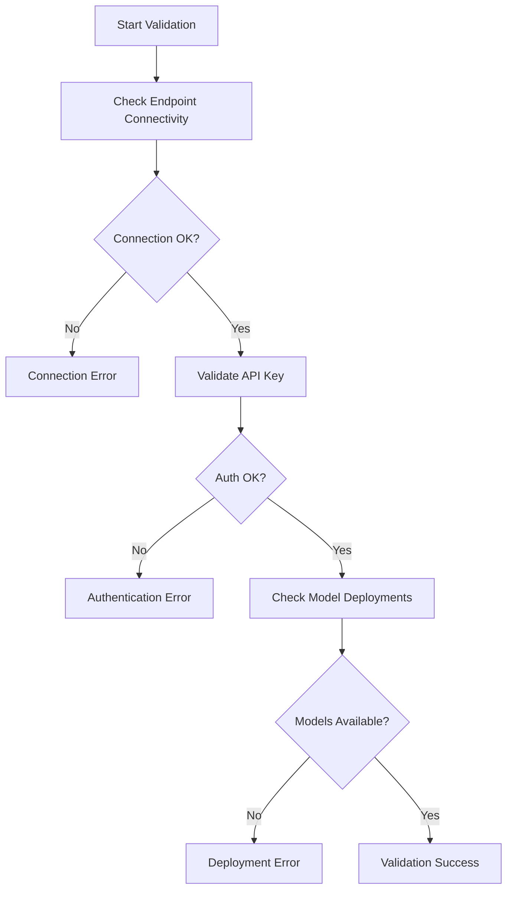

# Azure Image Studio - Complete Azure Setup & Configuration Guide

**Version:** 1.0.1  
**Author:** Hazem Ali, Microsoft AI MVP  
**GitHub:** [https://github.com/DrHazemAli](https://github.com/DrHazemAli)  
**LinkedIn:** [https://www.linkedin.com/in/drhazemali/](https://www.linkedin.com/in/drhazemali/)  
**Website:** [https://www.skytells.ai](https://www.skytells.ai)  
**Repository:** [https://github.com/DrHazemAli/azure-image-studio](https://github.com/DrHazemAli/azure-image-studio)  
**Last Updated:** September 10, 2025

---

## 🚨 CRITICAL SECURITY NOTICE

<div style="border: 3px solid #dc3545; padding: 20px; margin: 20px 0; background-color: #f8d7da; border-radius: 8px;">

### ⚠️ DEFAULT CREDENTIALS WARNING

**This application ships with DEFAULT ADMIN CREDENTIALS:**
- **Username:** `hazem` (configured in app-config.json)
- **Password:** `0000`

### 🔒 IMMEDIATE SECURITY ACTION REQUIRED

Before deploying to any environment accessible by others:

1. **CHANGE THE DEFAULT PASSWORD IMMEDIATELY**
2. Navigate to `/src/app/config/app-config.json`
3. Update the `admin.password` field
4. Use a strong password with minimum 12 characters
5. Consider implementing proper authentication (OAuth, SAML, etc.)

### Production Security Recommendations

- Replace the simple password-based authentication with enterprise-grade authentication
- Implement proper JWT token management
- Add rate limiting and brute-force protection  
- Enable HTTPS/TLS encryption
- Set up proper session management
- Implement audit logging for all authentication attempts

**NEVER use the default credentials `hazem:0000` in production environments.**

</div>

---

## Table of Contents

1. [Security Setup & Warnings](#security-setup--warnings)
2. [Azure Services Setup](#azure-services-setup)
3. [Step-by-Step Azure Configuration](#step-by-step-azure-configuration)
4. [Settings UI Walkthrough](#settings-ui-walkthrough)
5. [Model Configuration](#model-configuration)
6. [Auto-Sync and Data Management](#auto-sync-and-data-management)
7. [Advanced Configuration](#advanced-configuration)
8. [Troubleshooting](#troubleshooting)
9. [Best Practices](#best-practices)

---

## 1. Security Setup & Warnings

### 1.1 Authentication System Overview

Azure Image Studio uses a token-based authentication system with the following components:

- **Admin Authentication:** Simple username/password authentication
- **Token Generation:** Secure random tokens with 1-hour expiration
- **Session Management:** In-memory token storage (development mode)
- **API Protection:** All Azure API routes require valid authentication

### 1.2 Default Credentials Structure

The authentication credentials are stored in `/src/app/config/app-config.json`:

```json
{
  "admin": {
    "user_id": "dcee1a95-7dd1-4ba0-9ce6-84f1786fbe76",
    "name": "Hazem Ali",
    "username": "hazem",
    "role": "admin", 
    "password": "0000",
    "email": "your-email"
  }
}
```

### 1.3 Security Best Practices

#### Immediate Actions:
1. **Change Default Password**
   ```json
   {
     "admin": {
       "password": "YourSecurePassword123!"
     }
   }
   ```

2. **Update Email Address**
   ```json
   {
     "admin": {
       "email": "admin-email"
     }
   }
   ```

#### Production Security Recommendations:

1. **Implement Password Hashing**
   - Replace plain text passwords with bcrypt hashes
   - Update the verification logic in `/src/lib/auth.ts`

2. **Enable HTTPS**
   ```javascript
   // next.config.ts
   const nextConfig = {
     experimental: {
       forceSwcTransforms: true,
     },
     async headers() {
       return [
         {
           source: '/(.*)',
           headers: [
             {
               key: 'Strict-Transport-Security',
               value: 'max-age=63072000; includeSubDomains; preload'
             }
           ]
         }
       ]
     }
   }
   ```

3. **Implement Rate Limiting**
   ```javascript
   // Add to your API routes
   const rateLimit = {
     windowMs: 15 * 60 * 1000, // 15 minutes
     maxRequests: 100,
     skipSuccessfulRequests: true
   };
   ```

### 1.4 Environment Variable Security

Create a `.env.local` file for sensitive configuration:

```env
# Azure Configuration
AZURE_OPENAI_API_KEY=your_primary_api_key_here
AZURE_OPENAI_ENDPOINT=https://your-resource.openai.azure.com/
AZURE_OPENAI_API_VERSION=2024-05-01-preview

# Admin Configuration
ADMIN_PASSWORD_HASH=your_bcrypt_hash_here
JWT_SECRET=your_jwt_secret_key_here

# Application Security
SESSION_SECRET=your_session_secret_here
CSRF_TOKEN_SECRET=your_csrf_secret_here
```

---

## 2. Azure Services Setup

### 2.1 Azure Subscription Requirements

Before configuring Azure Image Studio, ensure you have:

- **Active Azure Subscription** with sufficient credits
- **Contributor or Owner role** on the subscription
- **Access to Azure OpenAI Service** (may require approval)
- **Access to Azure AI Foundry** for FLUX models

### 2.2 Required Azure Services

#### 2.2.1 Azure OpenAI Service

**Purpose:** Provides access to GPT-Image-1 and other OpenAI models

**Setup Steps:**
1. Navigate to [Azure Portal](https://portal.azure.com)
2. Search for "Azure OpenAI" in the search bar
3. Click "Create" → "Azure OpenAI"
4. Configure the resource:
   ```
   Subscription: Your Azure subscription
   Resource Group: rg-azure-image-studio
   Region: East US (recommended for latest models)
   Name: aoai-image-studio-prod
   Pricing Tier: Standard S0
   ```
5. Click "Review + Create" → "Create"
6. Wait for deployment completion (~5-10 minutes)

#### 2.2.2 Azure AI Foundry Setup

**Purpose:** Provides access to FLUX and Microsoft Phi models

**Setup Steps:**
1. Navigate to [Azure AI Foundry](https://ai.azure.com)
2. Sign in with your Azure account
3. Create a new project:
   ```
   Project Name: azure-image-studio-models
   Resource Group: rg-azure-image-studio
   Location: East US
   ```
4. Enable required model families:
   - FLUX.1-Kontext-pro
   - Microsoft Phi-3.5-vision
   - Florence-2

### 2.3 Resource Group Organization

Create a dedicated resource group for better organization:

```bash
# Using Azure CLI
az group create --name rg-azure-image-studio --location eastus
```

**Recommended Resource Structure:**
```
rg-azure-image-studio/
├── aoai-image-studio-prod (Azure OpenAI Service)
├── ai-foundry-image-studio (AI Foundry Hub)
├── kv-image-studio-secrets (Key Vault - optional)
└── storage-imagestudio001 (Storage Account - optional)
```

### 2.4 Service Principal Creation

For production deployments, create a service principal:

```bash
# Create service principal
az ad sp create-for-rbac --name "azure-image-studio-sp" \
    --role "Cognitive Services Contributor" \
    --scopes /subscriptions/{subscription-id}/resourceGroups/rg-azure-image-studio

# Output example:
{
  "appId": "12345678-1234-1234-1234-123456789012",
  "displayName": "azure-image-studio-sp",
  "password": "your-service-principal-password",
  "tenant": "87654321-4321-4321-4321-210987654321"
}
```

---

## 3. Step-by-Step Azure Configuration

### 3.1 Accessing Settings in Azure Image Studio

#### Step 1: Application Login
1. Start Azure Image Studio application
2. Navigate to the login screen
3. Enter credentials:
   - **Username:** `hazem` (default)
   - **Password:** `0000` (⚠️ **CHANGE THIS IMMEDIATELY**)
4. Click "Login"

#### Step 2: Accessing Azure Settings
1. Once logged in, look for the Settings icon (⚙️) in the navigation
2. Click on "Settings" to open the Settings Dialog
3. Navigate to the "Azure" tab in the settings panel

### 3.2 Primary Configuration Section

The Azure settings are divided into several key sections:

#### Step 3: Primary Azure Configuration
1. In the Azure settings tab, locate the "Primary Configuration" section
2. Fill in the following required fields:

```
Primary API Key: [Your Azure OpenAI API Key]
Primary Endpoint: https://your-resource.openai.azure.com/
```

**How to obtain these values:**

**API Key:**
1. Go to [Azure Portal](https://portal.azure.com)
2. Navigate to your Azure OpenAI resource
3. Click "Keys and Endpoint" in the left menu
4. Copy "Key 1" value

**Endpoint URL:**
1. In the same "Keys and Endpoint" section
2. Copy the "Endpoint" URL
3. Ensure it follows the format: `https://your-resource.openai.azure.com/`

#### Step 4: Default Settings Configuration
Configure the default generation settings:

```
Output Format: png (recommended) or jpeg
Size: 1024x1024 (fastest) or custom dimensions
Number of Images (n): 1-10 (start with 1)
```

#### Step 5: UI Preferences
Set up the user interface preferences:

```
Theme: light, dark, or system (follows OS theme)
Show Console: Enable for debugging (disable in production)
Animations Enabled: true (improves user experience)
```

### 3.3 Endpoint Management Interface

#### Step 6: Adding Multiple Endpoints
Azure Image Studio supports multiple Azure endpoints for load balancing and redundancy:

1. Scroll down to the "Endpoint Management" section
2. Click "Add New Endpoint"
3. Fill in the endpoint details:
   ```
   Endpoint Name: Production East US
   Base URL: https://your-prod-resource.openai.azure.com/
   API Version: 2024-05-01-preview
   API Key: [Endpoint-specific API key] (optional)
   Resource Name: your-prod-resource (optional)
   ```
4. Click "Add Endpoint"

#### Step 7: Configuring Deployments for Each Endpoint
For each endpoint, configure model deployments:

1. Click on an endpoint to expand its configuration
2. Click "Add Deployment"
3. Configure deployment details:
   ```
   Deployment ID: gpt-image-1-deployment
   Name: GPT-Image-1 Production
   Deployment Name: gpt-image-1 (must match Azure deployment)
   Max Size: 1536x1536
   Supported Formats: png, jpeg
   Description: Primary image generation model
   ```

### 3.4 Model Deployment Setup in Azure

Before configuring deployments in the application, ensure models are deployed in Azure:

#### Azure OpenAI Model Deployment:
1. Go to [Azure OpenAI Studio](https://oai.azure.com)
2. Select your resource
3. Go to "Deployments" tab
4. Click "Create new deployment"
5. Configure deployment:
   ```
   Model: gpt-image-1
   Deployment Name: gpt-image-1 (remember this name)
   Model Version: Latest
   Tokens per Minute Rate Limit: 10K (adjust based on needs)
   ```
6. Click "Create"

#### Azure AI Foundry Model Deployment:
1. Go to [Azure AI Foundry](https://ai.azure.com)
2. Navigate to your project
3. Go to "Models + endpoints"
4. Click "Deploy a model"
5. Search for and select "FLUX.1-Kontext-pro"
6. Configure deployment:
   ```
   Deployment Name: flux-kontext-pro
   Endpoint Name: flux-endpoint-01
   Instance Type: Standard_NC6s_v3 (or appropriate GPU instance)
   Instance Count: 1
   ```
7. Click "Deploy"

---

## 4. Settings UI Walkthrough

### 4.1 Navigation and Layout

The Settings UI is organized into several tabs for easy navigation:

```
Settings Dialog
├── General (Application-wide settings)
├── Azure (Azure service configuration) ← Primary focus
├── Models (Model management and configuration)
├── Advanced (Performance and advanced options)
├── Logger (Debugging and logging options)
└── About (Version and author information)
```

### 4.2 Azure Tab Deep Dive

#### Primary Configuration Panel
```typescript
interface AzureConfig {
  primary: {
    status: 'valid' | 'invalid' | 'pending' | 'idle';
    validated_at: string | null;
  };
  primaryApiKey: string;
  primaryEndpoint: string;
  defaultSettings: {
    outputFormat: string;
    size: string;
    n: number;
  };
  ui: {
    theme: string;
    showConsole: boolean;
    animationsEnabled: boolean;
  };
}
```

#### Endpoint Management Panel
Each endpoint configuration includes:
- **Basic Information:** Name, Base URL, API Version
- **Authentication:** API Key, Resource Name
- **Deployments:** Model deployments associated with the endpoint
- **Status Indicators:** Real-time validation status
- **Actions:** Edit, Delete, Validate, Test

### 4.3 Real-time Status Indicators

The UI provides real-time feedback on configuration status:

#### Status Icons and Meanings:
- 🟢 **Valid:** Configuration is working correctly
- 🔴 **Invalid:** Configuration has errors
- 🟡 **Pending:** Validation in progress
- ⚪ **Idle:** Not yet validated

#### Validation Process:
1. **Automatic Validation:** Triggered when configuration changes
2. **Manual Validation:** Click "Validate" button for immediate check
3. **Test Generation:** Click "Test" to perform actual image generation
4. **Status Persistence:** Validation results are saved and displayed

### 4.4 Error Handling and Validation

#### Common Validation Errors:

1. **Invalid API Key**
   ```
   Error: Authentication failed
   Solution: Verify API key is correct and has proper permissions
   ```

2. **Wrong Endpoint URL**
   ```
   Error: Endpoint not reachable
   Solution: Check URL format and resource name
   ```

3. **Missing Model Deployment**
   ```
   Error: Deployment 'gpt-image-1' not found
   Solution: Deploy model in Azure OpenAI Studio
   ```

4. **API Version Mismatch**
   ```
   Error: API version not supported
   Solution: Update to supported API version (2024-05-01-preview)
   ```

### 4.5 Configuration Validation Process

The application performs comprehensive validation:

#### Validation Steps:
1. **Endpoint Connectivity:** Test HTTP connection to Azure endpoint
2. **Authentication Check:** Verify API key validity
3. **Model Availability:** Check if configured models are deployed
4. **Permission Validation:** Ensure API key has required permissions
5. **Rate Limit Check:** Verify rate limits and quotas

#### Validation Code Flow:
```typescript
// Validation process in /src/app/api/azure/validate/route.ts
async function validateAzureConfig(config: AzureConfig) {
  // 1. Test endpoint connectivity
  const connectionTest = await testEndpointConnectivity(config.primaryEndpoint);
  
  // 2. Validate API key
  const authTest = await validateApiKey(config.primaryApiKey, config.primaryEndpoint);
  
  // 3. Check model deployments
  const modelsTest = await checkModelDeployments(config);
  
  // 4. Return comprehensive validation result
  return {
    isValid: connectionTest && authTest && modelsTest,
    details: { connectionTest, authTest, modelsTest },
    timestamp: new Date().toISOString()
  };
}
```

---

## 5. Model Configuration

### 5.1 Adding Models via Settings UI

The Azure Image Studio supports multiple AI models for different use cases:

#### Step 1: Navigate to Models Tab
1. In the Settings dialog, click on the "Models" tab
2. Review the list of available models
3. Models are loaded from `/src/app/config/azure-models.json`

#### Step 2: Enable/Configure Models
For each model, you can:
1. **Enable/Disable:** Toggle model availability
2. **Configure Deployment:** Set Azure deployment name
3. **Customize Settings:** Adjust model-specific parameters
4. **Test Model:** Perform test generation

### 5.2 azure-models.json Configuration

The models configuration file defines all available models:

```json
{
  "imageModels": {
    "generation": {
      "openai": [
        {
          "id": "gpt-image-1",
          "name": "GPT-Image-1",
          "description": "Latest model with enhanced capabilities including image editing and inpainting",
          "provider": "Azure OpenAI",
          "apiVersion": "2025-04-01-preview",
          "capabilities": [
            "text-to-image",
            "image-editing", 
            "inpainting",
            "outpainting",
            "image-to-image"
          ],
          "supportedSizes": [
            {
              "size": "1024x1024",
              "label": "Square (1:1)",
              "aspect": "1:1", 
              "description": "Fastest generation"
            },
            {
              "size": "1024x1536",
              "label": "Portrait (2:3)",
              "aspect": "2:3",
              "description": "Vertical orientation"
            },
            {
              "size": "1536x1024", 
              "label": "Landscape (3:2)",
              "aspect": "3:2",
              "description": "Horizontal orientation"
            }
          ],
          "supportedFormats": ["png", "jpeg"],
          "qualityLevels": ["low", "medium", "high"],
          "maxImages": 10,
          "requiresApproval": true,
          "premium": true,
          "features": {
            "textRendering": true,
            "preciseInstructions": true,
            "imageInput": true,
            "streaming": true,
            "compression": true
          }
        }
      ],
      "microsoft": [
        {
          "id": "FLUX.1-Kontext-pro",
          "name": "FLUX 1 Kontext Pro",
          "description": "Microsoft's advanced vision-language model optimized for professional image generation",
          "provider": "Microsoft Azure AI",
          "apiVersion": "2024-05-01",
          "capabilities": [
            "text-to-image",
            "style-transfer",
            "high-resolution",
            "professional-quality"
          ],
          "supportedSizes": [
            {
              "size": "1024x1024",
              "label": "Square (1:1)",
              "aspect": "1:1",
              "description": "Standard generation"
            },
            {
              "size": "1152x896",
              "label": "Landscape (4:3)",
              "aspect": "4:3", 
              "description": "Wide format"
            },
            {
              "size": "896x1152",
              "label": "Portrait (3:4)", 
              "aspect": "3:4",
              "description": "Tall format"
            }
          ],
          "supportedFormats": ["png", "jpeg"],
          "maxImages": 4,
          "requiresApproval": false,
          "primary": true,
          "features": {
            "highQuality": true,
            "styleControl": true,
            "fastGeneration": true,
            "photorealistic": true
          }
        }
      ]
    }
  },
  "endpoints": [
    {
      "id": "azure-openai-primary",
      "name": "Azure OpenAI Primary",
      "baseUrl": "https://PLACEHOLDER-RESOURCE.openai.azure.com/",
      "type": "azure-openai",
      "deployments": [
        {
          "modelId": "gpt-image-1",
          "deploymentName": "gpt-image-1",
          "enabled": true,
          "note": "Primary image generation deployment"
        }
      ]
    },
    {
      "id": "azure-ai-foundry-primary", 
      "name": "Azure AI Foundry Primary",
      "baseUrl": "https://PLACEHOLDER-ENDPOINT.eastus.inference.ai.azure.com/",
      "type": "azure-ai-foundry",
      "deployments": [
        {
          "modelId": "FLUX.1-Kontext-pro",
          "deploymentName": "flux-kontext-pro",
          "enabled": true,
          "note": "FLUX model deployment"
        }
      ]
    }
  ]
}
```

### 5.3 Model Validation Process

Each model undergoes validation to ensure proper configuration:

#### Validation Checks:
1. **Deployment Availability:** Check if model is deployed in Azure
2. **API Compatibility:** Verify API version compatibility  
3. **Permission Check:** Ensure API key has access to the model
4. **Feature Validation:** Confirm supported features are available
5. **Performance Test:** Optional generation test

#### Validation Results:
- **Status:** valid, invalid, pending, idle
- **Timestamp:** Last validation time
- **Details:** Specific validation results
- **Errors:** Any validation errors encountered

### 5.4 Deployment Name Mapping

Critical for proper model functionality:

#### Azure OpenAI Models:
- **Model ID:** `gpt-image-1` (in azure-models.json)
- **Deployment Name:** Must match the deployment name in Azure OpenAI Studio
- **Endpoint Configuration:** Links model to specific Azure endpoint

#### Azure AI Foundry Models:
- **Model ID:** `FLUX.1-Kontext-pro` (in azure-models.json)
- **Deployment Name:** Must match the deployment name in AI Foundry
- **Endpoint Configuration:** Links model to specific AI Foundry endpoint

#### Configuration Example:
```typescript
// In Settings UI
const deploymentConfig = {
  modelId: "gpt-image-1",
  deploymentName: "gpt-image-1-prod", // Must match Azure deployment
  enabled: true,
  endpointId: "azure-openai-primary"
};
```

### 5.5 Provider-Specific Settings

Different providers have unique configuration requirements:

#### Azure OpenAI Settings:
```json
{
  "apiVersion": "2024-05-01-preview",
  "deployment": "gpt-image-1",
  "maxTokens": 4000,
  "temperature": 0.7,
  "topP": 1.0
}
```

#### Azure AI Foundry Settings:
```json
{
  "apiVersion": "2024-05-01",
  "deployment": "flux-kontext-pro", 
  "guidanceScale": 7.5,
  "numInferenceSteps": 20,
  "seed": null
}
```

---

## 6. Auto-Sync and Data Management

### 6.1 Auto-Sync Functionality Setup

Azure Image Studio includes advanced data synchronization capabilities:

#### Configuration Storage:
- **Local Storage:** Browser localStorage for immediate access
- **IndexedDB:** Structured data storage for complex configurations
- **Session Storage:** Temporary data for current session
- **Server Persistence:** Optional server-side configuration storage

#### Auto-Sync Features:
1. **Configuration Sync:** Azure settings sync across browser sessions
2. **Model Preferences:** User model preferences and customizations
3. **Generation History:** Optional history synchronization
4. **Asset Management:** Centralized asset storage and sync

### 6.2 Cross-Device Synchronization

Enable synchronization across multiple devices:

#### Setup Steps:
1. Navigate to Settings → Advanced
2. Enable "Cross-Device Sync"
3. Configure sync preferences:
   ```
   Sync Azure Configuration: ✓ Enabled
   Sync Model Preferences: ✓ Enabled  
   Sync Generation History: ✗ Disabled (privacy)
   Sync UI Preferences: ✓ Enabled
   ```

#### Sync Implementation:
```typescript
// Auto-sync configuration
interface SyncConfig {
  enabled: boolean;
  syncInterval: number; // minutes
  conflictResolution: 'client' | 'server' | 'manual';
  encryptionEnabled: boolean;
  syncEndpoint?: string;
}

const defaultSyncConfig: SyncConfig = {
  enabled: false,
  syncInterval: 15,
  conflictResolution: 'client',
  encryptionEnabled: true
};
```

### 6.3 Backup and Restore Settings

#### Backup Configuration:
1. Go to Settings → Advanced → Data Management
2. Click "Export Configuration"
3. Save the generated JSON file securely
4. Configuration includes:
   - Azure endpoints and API keys (encrypted)
   - Model configurations and preferences
   - UI settings and customizations
   - Validation history and status

#### Configuration Export Format:
```json
{
  "version": "1.0.1",
  "exportDate": "2025-09-10T20:00:00.000Z",
  "encrypted": true,
  "configuration": {
    "azure": "encrypted_azure_config_data",
    "models": "encrypted_models_config_data", 
    "ui": "encrypted_ui_preferences_data",
    "advanced": "encrypted_advanced_settings_data"
  },
  "checksum": "sha256_checksum_for_integrity"
}
```

#### Restore Process:
1. Go to Settings → Advanced → Data Management
2. Click "Import Configuration" 
3. Select your backup JSON file
4. Enter decryption password if required
5. Review import preview
6. Confirm import and restart application

### 6.4 Data Persistence Options

Configure how data is stored and managed:

#### Storage Levels:
1. **Session Only:** Data cleared when browser closes
2. **Local Persistent:** Data persists across browser sessions
3. **Server Storage:** Data stored on application server
4. **Cloud Sync:** Data synchronized with cloud storage

#### Privacy and Security:
- **Encryption:** All sensitive data encrypted at rest
- **Key Management:** Secure key derivation and storage
- **Access Control:** Role-based access to configuration data
- **Audit Logging:** Track all configuration changes

---

## 7. Advanced Configuration

### 7.1 Multiple Endpoint Support

Azure Image Studio supports sophisticated endpoint management for enterprise environments:

#### Load Balancing Configuration:
```typescript
interface EndpointConfig {
  id: string;
  name: string;
  baseUrl: string;
  weight: number; // For load balancing
  priority: number; // Failover priority
  regions: string[]; // Geographical regions
  capabilities: string[]; // Supported capabilities
  rateLimit: {
    rpm: number; // Requests per minute
    tpm: number; // Tokens per minute
  };
  healthCheck: {
    enabled: boolean;
    interval: number; // seconds
    timeout: number; // seconds
  };
}
```

#### Endpoint Selection Strategy:
1. **Round Robin:** Distribute requests evenly across endpoints
2. **Weighted:** Distribute based on endpoint weights
3. **Priority:** Use highest priority available endpoint
4. **Geographic:** Route to nearest geographic region
5. **Capability-Based:** Route based on model capabilities

#### Configuration Example:
```json
{
  "endpoints": [
    {
      "id": "primary-east-us",
      "name": "Primary East US",
      "baseUrl": "https://primary-eastus.openai.azure.com/",
      "weight": 70,
      "priority": 1,
      "regions": ["eastus", "eastus2"],
      "rateLimit": { "rpm": 300, "tpm": 10000 }
    },
    {
      "id": "secondary-west-us", 
      "name": "Secondary West US",
      "baseUrl": "https://secondary-westus.openai.azure.com/",
      "weight": 30,
      "priority": 2,
      "regions": ["westus", "westus2"],
      "rateLimit": { "rpm": 200, "tpm": 8000 }
    }
  ]
}
```

### 7.2 Environment Variable Integration

Integrate with environment variables for secure configuration management:

#### Environment Variable Schema:
```env
# Primary Azure Configuration
AZURE_OPENAI_API_KEY=your_primary_api_key_here
AZURE_OPENAI_ENDPOINT=https://your-primary-resource.openai.azure.com/
AZURE_OPENAI_API_VERSION=2024-05-01-preview
AZURE_OPENAI_DEPLOYMENT_NAME=gpt-image-1

# Secondary Endpoints
AZURE_OPENAI_SECONDARY_API_KEY=your_secondary_api_key_here
AZURE_OPENAI_SECONDARY_ENDPOINT=https://your-secondary-resource.openai.azure.com/

# Azure AI Foundry Configuration
AZURE_AI_FOUNDRY_API_KEY=your_ai_foundry_api_key_here
AZURE_AI_FOUNDRY_ENDPOINT=https://your-endpoint.eastus.inference.ai.azure.com/
AZURE_AI_FOUNDRY_DEPLOYMENT_NAME=flux-kontext-pro

# Application Configuration
APP_ENVIRONMENT=production
LOG_LEVEL=info
ENABLE_TELEMETRY=true
ENABLE_RATE_LIMITING=true
```

#### Environment Integration Code:
```typescript
// /src/lib/env.ts
export const envConfig = {
  azure: {
    openai: {
      apiKey: process.env.AZURE_OPENAI_API_KEY,
      endpoint: process.env.AZURE_OPENAI_ENDPOINT,
      apiVersion: process.env.AZURE_OPENAI_API_VERSION || '2024-05-01-preview',
      deploymentName: process.env.AZURE_OPENAI_DEPLOYMENT_NAME
    },
    aiFoundry: {
      apiKey: process.env.AZURE_AI_FOUNDRY_API_KEY,
      endpoint: process.env.AZURE_AI_FOUNDRY_ENDPOINT,
      deploymentName: process.env.AZURE_AI_FOUNDRY_DEPLOYMENT_NAME
    }
  },
  app: {
    environment: process.env.APP_ENVIRONMENT || 'development',
    logLevel: process.env.LOG_LEVEL || 'info'
  }
};
```

### 7.3 Custom Model Configurations

Advanced users can define custom model configurations:

#### Custom Model Schema:
```typescript
interface CustomModelConfig {
  id: string;
  name: string;
  description: string;
  provider: 'azure-openai' | 'azure-ai-foundry' | 'custom';
  endpointId: string;
  deploymentName: string;
  apiVersion: string;
  capabilities: string[];
  parameters: {
    [key: string]: {
      type: 'string' | 'number' | 'boolean';
      default: any;
      min?: number;
      max?: number;
      options?: string[];
    };
  };
  preprocessing?: {
    imageResize: boolean;
    imageFormat: string;
    maxDimensions: { width: number; height: number; };
  };
  postprocessing?: {
    enableUpscaling: boolean;
    enableFiltering: boolean;
    outputFormat: string;
  };
}
```

#### Custom Model Example:
```json
{
  "id": "custom-flux-optimized",
  "name": "Custom FLUX Optimized",
  "description": "Custom FLUX configuration optimized for professional photography",
  "provider": "azure-ai-foundry",
  "endpointId": "ai-foundry-premium",
  "deploymentName": "flux-kontext-pro-custom",
  "apiVersion": "2024-05-01",
  "capabilities": ["text-to-image", "high-resolution", "style-control"],
  "parameters": {
    "guidance_scale": {
      "type": "number",
      "default": 7.5,
      "min": 1.0,
      "max": 20.0
    },
    "num_inference_steps": {
      "type": "number", 
      "default": 50,
      "min": 10,
      "max": 100
    },
    "style_preset": {
      "type": "string",
      "default": "photographic",
      "options": ["photographic", "artistic", "cinematic", "portrait"]
    }
  },
  "preprocessing": {
    "imageResize": true,
    "imageFormat": "png",
    "maxDimensions": { "width": 2048, "height": 2048 }
  },
  "postprocessing": {
    "enableUpscaling": true,
    "enableFiltering": false,
    "outputFormat": "png"
  }
}
```

### 7.4 Performance Optimization Settings

Configure advanced performance settings for optimal operation:

#### Performance Configuration:
```typescript
interface PerformanceConfig {
  generation: {
    maxConcurrentRequests: number;
    requestTimeout: number; // milliseconds
    retryAttempts: number;
    retryDelay: number; // milliseconds
    batchSize: number; // for batch generation
  };
  caching: {
    enableRequestCache: boolean;
    cacheExpiration: number; // minutes
    maxCacheSize: number; // MB
    cacheStrategy: 'lru' | 'fifo' | 'ttl';
  };
  optimization: {
    enableImageCompression: boolean;
    compressionQuality: number; // 0.1-1.0
    enableProgressiveLoading: boolean;
    enableLazyLoading: boolean;
  };
  monitoring: {
    enablePerformanceMetrics: boolean;
    enableErrorTracking: boolean;
    metricsEndpoint?: string;
  };
}
```

#### Optimization Recommendations:

**For High-Volume Usage:**
```json
{
  "generation": {
    "maxConcurrentRequests": 5,
    "requestTimeout": 60000,
    "retryAttempts": 3,
    "batchSize": 4
  },
  "caching": {
    "enableRequestCache": true,
    "cacheExpiration": 60,
    "maxCacheSize": 500
  }
}
```

**For Low-Latency Usage:**
```json
{
  "generation": {
    "maxConcurrentRequests": 2,
    "requestTimeout": 30000,
    "retryAttempts": 1,
    "batchSize": 1
  },
  "optimization": {
    "enableProgressiveLoading": true,
    "compressionQuality": 0.8
  }
}
```

---

## 8. Troubleshooting

### 8.1 Common Configuration Issues

#### Issue: Authentication Failed
```
Error: 401 Unauthorized - Authentication failed
```

**Diagnosis Steps:**
1. Verify API key is correctly entered
2. Check if API key has expired
3. Confirm resource has proper permissions
4. Test API key with direct Azure API call

**Solutions:**
```bash
# Test API key directly
curl -H "Authorization: Bearer YOUR_API_KEY" \
     -H "Content-Type: application/json" \
     "https://your-resource.openai.azure.com/openai/deployments?api-version=2024-05-01-preview"
```

#### Issue: Model Not Found
```
Error: The API deployment for this resource does not exist
```

**Diagnosis Steps:**
1. Check if model is deployed in Azure
2. Verify deployment name matches configuration
3. Confirm API version compatibility

**Solutions:**
1. Deploy model in Azure OpenAI Studio:
   - Go to Azure OpenAI Studio
   - Navigate to Deployments
   - Create new deployment with exact name used in config
2. Update deployment name in Azure Image Studio settings
3. Verify API version is supported

#### Issue: Endpoint Not Reachable
```
Error: Network error - Unable to reach endpoint
```

**Diagnosis Steps:**
1. Check endpoint URL format
2. Verify resource name and region
3. Test network connectivity
4. Check firewall/proxy settings

**Solutions:**
```bash
# Test endpoint connectivity
curl -I "https://your-resource.openai.azure.com/"

# Check DNS resolution
nslookup your-resource.openai.azure.com
```

#### Issue: Rate Limit Exceeded
```
Error: 429 Too Many Requests - Rate limit exceeded
```

**Diagnosis Steps:**
1. Check current rate limits in Azure
2. Review request frequency
3. Monitor usage patterns

**Solutions:**
1. Increase rate limits in Azure (if available)
2. Implement request queuing
3. Add multiple endpoints for load distribution
4. Optimize request frequency

### 8.2 Validation Error Troubleshooting

#### Validation Process Flow:


#### Detailed Error Codes:

**CONNECTION_FAILED (1001):**
```json
{
  "error": "CONNECTION_FAILED",
  "code": 1001,
  "message": "Unable to connect to Azure endpoint",
  "details": "Network timeout or DNS resolution failure",
  "solution": "Check endpoint URL and network connectivity"
}
```

**AUTH_INVALID (1002):**
```json
{
  "error": "AUTH_INVALID", 
  "code": 1002,
  "message": "API key authentication failed",
  "details": "Invalid or expired API key",
  "solution": "Verify API key and check permissions"
}
```

**DEPLOYMENT_NOT_FOUND (1003):**
```json
{
  "error": "DEPLOYMENT_NOT_FOUND",
  "code": 1003,
  "message": "Model deployment not found",
  "details": "Deployment 'gpt-image-1' does not exist",
  "solution": "Create deployment in Azure or update deployment name"
}
```

### 8.3 Performance Issues

#### Slow Generation Times

**Symptoms:**
- Image generation takes > 60 seconds
- Frequent timeouts
- Poor user experience

**Diagnosis:**
```typescript
// Enable performance monitoring
const performanceConfig = {
  enableTiming: true,
  enableMetrics: true,
  logSlowRequests: true,
  slowRequestThreshold: 30000 // 30 seconds
};
```

**Solutions:**
1. **Optimize Model Settings:**
   ```json
   {
     "num_inference_steps": 20,
     "guidance_scale": 7.5,
     "size": "1024x1024"
   }
   ```

2. **Use Multiple Endpoints:**
   ```json
   {
     "loadBalancing": {
       "strategy": "round-robin",
       "healthCheck": true,
       "failoverEnabled": true
     }
   }
   ```

3. **Implement Caching:**
   ```typescript
   const cacheConfig = {
     enableCache: true,
     cacheKey: (prompt, settings) => 
       `${hashPrompt(prompt)}-${JSON.stringify(settings)}`,
     expiration: 3600 // 1 hour
   };
   ```

#### Memory Issues

**Symptoms:**
- Browser becomes unresponsive
- Memory usage continuously increases
- Slow UI interactions

**Solutions:**
1. **Enable Image Compression:**
   ```json
   {
     "imageProcessing": {
       "enableCompression": true,
       "quality": 0.8,
       "maxDimensions": "2048x2048"
     }
   }
   ```

2. **Implement Lazy Loading:**
   ```typescript
   const uiConfig = {
     lazyLoadImages: true,
     virtualizeImageList: true,
     maxImagesInMemory: 20
   };
   ```

3. **Clear Cache Regularly:**
   ```typescript
   // Clear cache every hour
   setInterval(() => {
     if (cacheSize > MAX_CACHE_SIZE) {
       clearOldCacheEntries();
     }
   }, 3600000);
   ```

### 8.4 Network and Connectivity Issues

#### Proxy and Firewall Configuration

**Corporate Network Setup:**
```json
{
  "network": {
    "proxy": {
      "enabled": true,
      "host": "proxy.company.com",
      "port": 8080,
      "auth": {
        "username": "user",
        "password": "pass"
      }
    },
    "ssl": {
      "verifyCertificates": true,
      "customCACerts": ["path/to/ca-cert.pem"]
    }
  }
}
```

**Azure Endpoints Whitelist:**
```
# Required domains for Azure OpenAI
*.openai.azure.com
*.cognitive.microsoft.com
*.azure.com

# Required domains for Azure AI Foundry  
*.inference.ai.azure.com
*.ml.azure.com
*.azureml.net

# Required ports
HTTPS: 443
HTTP: 80 (for redirects)
```

---

## 9. Best Practices

### 9.1 Security Best Practices

#### API Key Management:
1. **Use Environment Variables:**
   ```bash
   # Production deployment
   export AZURE_OPENAI_API_KEY="your-secure-key"
   export AZURE_OPENAI_ENDPOINT="your-endpoint"
   ```

2. **Implement Key Rotation:**
   ```typescript
   // Regular key rotation schedule
   const keyRotationSchedule = {
     frequency: 'monthly', // or weekly for high-security environments
     autoRotate: true,
     notifyBeforeExpiration: 7 // days
   };
   ```

3. **Use Managed Identities (when possible):**
   ```typescript
   // Azure Managed Identity configuration
   const managedIdentityConfig = {
     type: 'system-assigned', // or user-assigned
     clientId: 'your-managed-identity-client-id',
     enableForAzureOpenAI: true
   };
   ```

#### Access Control:
```typescript
interface AccessControlConfig {
  authentication: {
    method: 'password' | 'oauth' | 'saml' | 'managed-identity';
    sessionTimeout: number; // minutes
    maxFailedAttempts: number;
    lockoutDuration: number; // minutes
  };
  authorization: {
    roles: string[];
    permissions: {
      [role: string]: string[];
    };
  };
  audit: {
    enableLogging: boolean;
    logLevel: 'info' | 'warning' | 'error';
    logDestination: 'file' | 'database' | 'azure-monitor';
  };
}
```

### 9.2 Performance Best Practices

#### Optimal Configuration for Different Use Cases:

**High-Volume Production:**
```json
{
  "endpoints": [
    {
      "name": "Primary Production",
      "weight": 60,
      "rateLimit": { "rpm": 500, "tpm": 50000 }
    },
    {
      "name": "Secondary Production", 
      "weight": 40,
      "rateLimit": { "rpm": 300, "tpm": 30000 }
    }
  ],
  "generation": {
    "maxConcurrentRequests": 10,
    "batchSize": 4,
    "enableQueue": true,
    "queueMaxSize": 100
  },
  "caching": {
    "enabled": true,
    "strategy": "lru",
    "maxSize": 1000, // MB
    "expiration": 3600 // seconds
  }
}
```

**Development Environment:**
```json
{
  "generation": {
    "maxConcurrentRequests": 2,
    "enableCache": true,
    "enableDebugLogging": true
  },
  "validation": {
    "strictMode": false,
    "enableWarnings": true
  }
}
```

**Testing Environment:**
```json
{
  "generation": {
    "enableMockResponses": true,
    "mockDelay": 2000, // 2 seconds
    "enableValidation": true
  },
  "monitoring": {
    "enableMetrics": true,
    "enableTracing": true
  }
}
```

### 9.3 Monitoring and Observability

#### Implement Comprehensive Monitoring:

```typescript
interface MonitoringConfig {
  metrics: {
    enabled: boolean;
    provider: 'azure-monitor' | 'prometheus' | 'custom';
    endpoint?: string;
    metrics: {
      requestCount: boolean;
      requestDuration: boolean;
      errorRate: boolean;
      cacheHitRate: boolean;
      endpointHealth: boolean;
    };
  };
  logging: {
    level: 'debug' | 'info' | 'warn' | 'error';
    format: 'json' | 'text';
    outputs: string[]; // ['console', 'file', 'azure-logs']
  };
  alerting: {
    enabled: boolean;
    rules: {
      errorRate: { threshold: 0.05, window: '5m' };
      responseTime: { threshold: 30000, window: '1m' };
      endpointDown: { threshold: 3, window: '30s' };
    };
  };
}
```

#### Key Metrics to Monitor:

1. **Generation Metrics:**
   - Average generation time
   - Success rate
   - Error rate by error type
   - Queue length (if applicable)

2. **Endpoint Health:**
   - Response time per endpoint
   - Availability percentage
   - Rate limit utilization

3. **Resource Usage:**
   - Memory consumption
   - CPU usage
   - Network bandwidth
   - Storage usage

### 9.4 Backup and Disaster Recovery

#### Configuration Backup Strategy:
```typescript
interface BackupStrategy {
  schedule: {
    frequency: 'daily' | 'weekly' | 'monthly';
    time: string; // HH:MM format
    timezone: string;
  };
  retention: {
    daily: number; // days
    weekly: number; // weeks
    monthly: number; // months
  };
  storage: {
    type: 'local' | 'azure-blob' | 's3' | 'custom';
    encryption: boolean;
    compression: boolean;
  };
  validation: {
    testRestore: boolean;
    frequency: 'weekly' | 'monthly';
  };
}
```

#### Disaster Recovery Plan:
1. **Regular Configuration Exports:**
   - Automated daily exports
   - Manual exports before major changes
   - Version-controlled configuration files

2. **Multiple Environment Setup:**
   - Development environment
   - Staging environment  
   - Production environment
   - Disaster recovery environment

3. **Failover Procedures:**
   ```typescript
   const failoverConfig = {
     automaticFailover: true,
     healthCheckInterval: 30, // seconds
     failureThreshold: 3, // consecutive failures
     failoverDelay: 10, // seconds
     notificationChannels: ['email', 'slack', 'teams']
   };
   ```

### 9.5 Scaling Recommendations

#### Horizontal Scaling:
```typescript
interface ScalingConfig {
  endpoints: {
    minEndpoints: number;
    maxEndpoints: number;
    scaleUpThreshold: number; // CPU or memory percentage
    scaleDownThreshold: number;
    cooldownPeriod: number; // minutes
  };
  loadBalancing: {
    algorithm: 'round-robin' | 'weighted' | 'least-connections';
    healthCheck: {
      enabled: boolean;
      interval: number; // seconds
      timeout: number; // seconds
    };
  };
  autoscaling: {
    enabled: boolean;
    metrics: string[]; // ['cpu', 'memory', 'request_rate']
    targetUtilization: number; // percentage
  };
}
```

#### Vertical Scaling:
- **Azure OpenAI:** Increase TPM (Tokens Per Minute) limits
- **Azure AI Foundry:** Scale up VM instances for deployments
- **Application:** Increase memory and CPU allocation

---

## Conclusion

This comprehensive guide provides all the necessary information to successfully configure and deploy Azure Image Studio with Azure services. The application leverages cutting-edge AI models from Azure OpenAI and Azure AI Foundry to deliver professional-grade image generation capabilities.

### Key Takeaways:

1. **Security First:** Always change default credentials and implement proper authentication
2. **Proper Configuration:** Take time to correctly configure Azure services and deployments
3. **Monitor Performance:** Implement monitoring and alerting for production deployments
4. **Plan for Scale:** Design your configuration to handle growth and increased usage
5. **Backup Regularly:** Maintain regular backups of your configuration and data

### Next Steps:

1. Complete the basic Azure setup following sections 1-4
2. Configure your preferred models using section 5
3. Implement advanced features based on your requirements (section 7)
4. Set up monitoring and alerting (section 9.3)
5. Plan your backup and disaster recovery strategy (section 9.4)

### Support and Community:

- **GitHub Repository:** [https://github.com/DrHazemAli/azure-image-studio](https://github.com/DrHazemAli/azure-image-studio)
- **Author Contact:** [Hazem Ali - Microsoft AI MVP](https://www.linkedin.com/in/drhazemali/)
- **Website:** [https://www.skytells.ai](https://www.skytells.ai)

For additional support, please refer to the [Troubleshooting Guide](troubleshooting-guide.mdx) or create an issue in the GitHub repository.

---

*This guide is part of the Azure Image Studio documentation suite. For more guides and tutorials, visit the [wiki directory](.).*

**Document Version:** 1.0.1  
**Last Updated:** September 10, 2025  
**Compatibility:** Azure Image Studio v1.0.1+